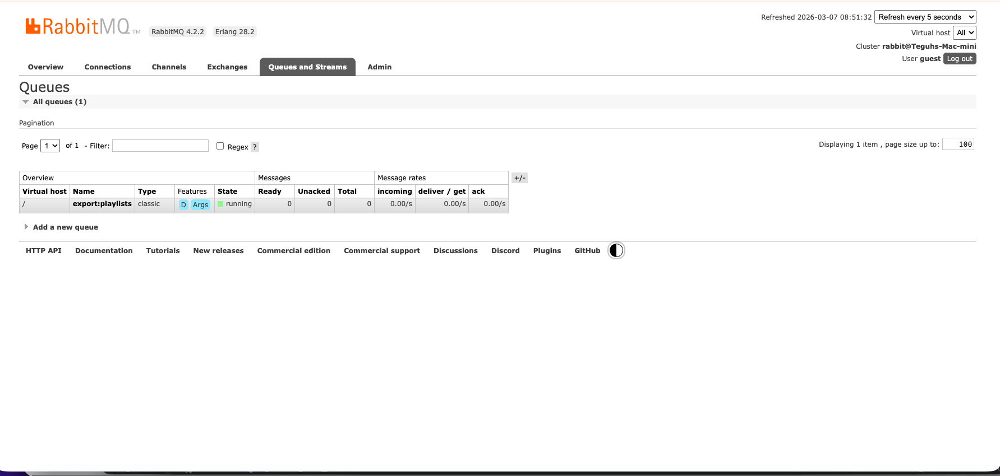
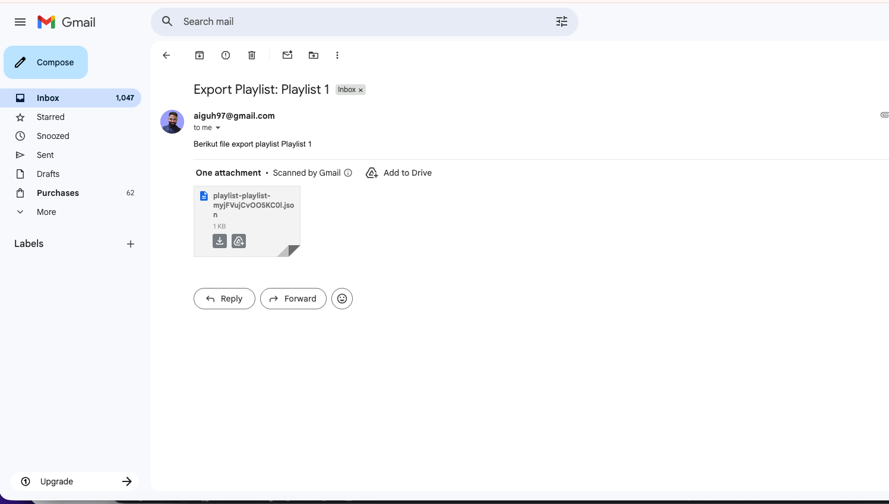

# OpenMusic API

Welcome to The OpenMusic-API Repository!

This project is a backend service for managing playlists and songs. It allows users to create playlists, add songs to playlists, and manage collaborations. Additionally, the service logs activities for adding and removing songs from playlists, providing an audit trail for user actions.

## Key Features

- Playlist Management: Create, update, and delete playlists.
- Albums Management: Create, update, and delete albums.
- Song Management: Add and remove songs.
- Collaborations: Allow multiple users to collaborate on a single playlist.
- Activity Logging: Track and log activities such as adding and removing songs from playlists.
- Authentication and Authorization: Secure access to playlists and songs.
- Export Playlist Songs: Export songs from a playlist and send them via email (RabbitMQ + consumer).
- Upload Album Cover: Upload album cover images.
- Like Albums: Like, unlike, and view the number of likes for an album.
- Server-Side Caching: Cache the number of likes for an album using Redis.

## Technologies Used

- Node.js
- Hapi.js
- PostgreSQL
- node-postgres
- RabbitMQ
- Mailtrap (recommended for testing email)
- Redis
- JWT
- Joi
- Nanoid
- Bcrypt
- Nodemailer

## Getting Started

### Prerequisites

- Node.js (14.7.0 or higher recommended)
- PostgreSQL
- RabbitMQ
- Redis
- Mailtrap (or any SMTP provider for testing)

### 1. Clone the repository

```bash
git clone https://github.com/falihdzakwanz/OpenMusic-API.git
cd OpenMusic-API
```

> Note: adjust the clone URL to your own fork or local path.

### 2. Install dependencies

```bash
npm install
```

### 3. Set up the database

Create a PostgreSQL database and run migrations:

```bash
npm run migrate up
```

### 4. Configure environment variables

Create a `.env` file based on `.env.example` and set the required environment variables (Postgres, RabbitMQ, Redis, SMTP, tokens):

- `HOST`, `PORT`
- `PGUSER`, `PGHOST`, `PGPASSWORD`, `PGDATABASE`, `PGPORT`
- `ACCESS_TOKEN_KEY`, `REFRESH_TOKEN_KEY`, `ACCESS_TOKEN_AGE`
- `RABBITMQ_SERVER`
- `REDIS_SERVER`
- `SMTP_HOST`, `SMTP_PORT`, `SMTP_USER`, `SMTP_PASSWORD`

### 5. Run the server

```bash
npm run start
```

Or in development with nodemon:

```bash
npm run start-dev
```

### 6. Set up and run the consumer program

The consumer listens to RabbitMQ queue `export:playlists` and will send exported playlist JSON via email.

```bash
npm run consumer
```

Make sure the consumer runs in a separate terminal while you use the API.

## API Endpoints (high-level)

- `POST /albums/{id}/covers` — upload album cover
- `POST /playlists` — create playlist
- `POST /songs` — create song
- `POST /playlists/{id}/songs` — add song to playlist
- `POST /export/playlists/{playlistId}` — export playlist songs (emails JSON via RabbitMQ & consumer)
- `POST /albums/{id}/likes` — like an album
- `DELETE /albums/{id}/likes` — unlike an album
- `GET /albums/{id}/likes` — get album likes (cached)

Refer to the project's Postman collection for full request/response examples.

## Notes

- This project was built for the Dicoding Academy course "Belajar Fundamental Aplikasi Back-End" and demonstrates using Hapi, PostgreSQL, RabbitMQ, Redis, and email sending via Nodemailer.

## Screenshots






---

If you'd like, I can:
- Update README with exact Postman instructions and example requests.
- Add more screenshots from your local runs (I can generate placeholder images or you can provide screenshots to embed).
